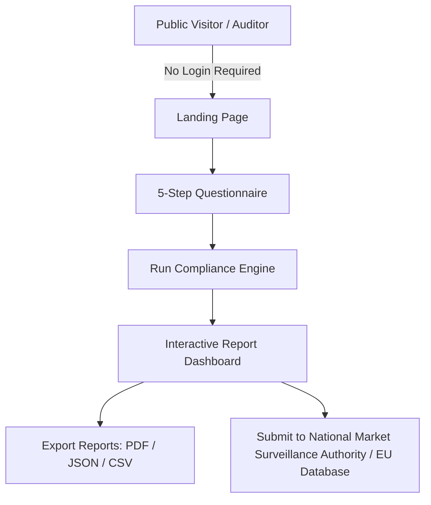
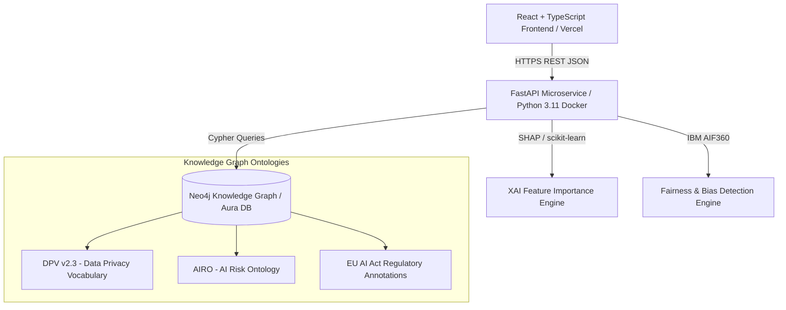

# Application User Operating Model & Legal Compliance Architecture
**EU AI Act Compliance Tool (Regulation (EU) 2024/1689 · Annex III Point 5(b))**

**Document Version:** 1.0.0  
**Date:** 2026-07-25  

**Domain:** LegalTech / RegTech / Financial Services (Credit Risk & AI Audit)  
**Legal Bases:** Regulation (EU) 2024/1689 (EU AI Act), GDPR (EU) 2016/679, EU Charter of Fundamental Rights  

---

## 1. Executive Summary

The **EU AI Act Compliance Tool** is a specialized B2B SaaS RegTech application, designed to automate the mandatory compliance audits for **High-Risk AI Credit Scoring Systems** under **Regulation (EU) 2024/1689 (EU AI Act), Annex III, Point 5(b)**.

Through one structured 5-step questionnaire, the platform generates within 2 seconds **five legally substantiated compliance reports** that meet the requirements of the European Market Surveillance Authorities and the European AI Office.

### Core Observations & Status:
* **Observation:** The application consists of a React/TypeScript frontend (Vercel) coupled with a Python 3.11 FastAPI microservice backend with Neo4j Knowledge Graph (Hugging Face Spaces).
* **[DERIVED]:** The tool transforms qualitative answers from the questionnaire into quantitative legal risk scores via ontology-based Cypher Graph traversals (DPV v2.3 & AIRO ontologies).
* **[SPECULATIVE]:** Future versions can directly scan production models (scikit-learn, XGBoost, PyTorch) for bias and SHAP values via REST through the BYOM (Bring Your Own Model) endpoint.
* **Risk:** If the backend microservices enter a 'sleep state' (Hugging Face 503), an automatic retry or fallback must be activated to guarantee report generation.
* **Action:** Ensure that the Neo4j Graph DB and FastAPI endpoints run via high-availability clustering for enterprise SLAs.

---

## 2. Legal Scope & EU AI Act Classification

### 2.1 Legal Bases and Applicable Law

| Jurisdiction / Regulation | Article / Provision | Description & Relevance |
|---|---|---|
| **Regulation (EU) 2024/1689 (EU AI Act)** | **Annex III, Point 5(b)** | High-Risk qualification: AI systems intended for creditworthiness assessment or credit scoring of natural persons. |
| **EU AI Act** | **Article 9** | Obligation to establish and maintain a continuous **Risk Management System** (ISO 31000). |
| **EU AI Act** | **Article 10(5)** | Requirements for **Data Governance**: Bias detection and correction on training and testing datasets (IBM AIF360). |
| **EU AI Act** | **Article 13** | **Transparency & Provision of Information** to providers/users (SHAP / LIME individual explanations). |
| **EU AI Act** | **Article 14** | **Human Oversight (Human-in-the-loop)**: Safeguards for intervention, override, and stop systems. |
| **EU AI Act** | **Article 15** | **Accuracy, Robustness & Cybersecurity**: Resilience against adversarial attacks (MITRE ATLAS / STRIDE-AI). |
| **EU AI Act** | **Article 27** | **Fundamental Rights Impact Assessment (FRIA)**: Assessment of impact on 7 EU Fundamental Rights. |
| **EU AI Act** | **Article 50** | Transparency obligations towards affected persons (notification upon AI assessment). |
| **GDPR (EU) 2016/679** | **Article 22** | Safeguards for automated individual decision-making and profiling. |
| **EU Charter of Fundamental Rights** | **Articles 1, 7, 8, 21, 47** | Human Dignity, Privacy, Data Protection, Non-Discrimination, Effective Remedy. |

---

## 3. Product Scope & Functionalities Matrix

| Component | Status | Source File(s) | Functionality & Legal Provision |
|---|---|---|---|
| **Landing Page** | `PASS` | [App.tsx](file:///c:/dev/ai-act-credit-compliance/source-repo/src/app/App.tsx) | Overview of 5 mandatory reports and Annex III Point 5(b) introduction. |
| **5-Step Questionnaire** | `PASS` | [QuestionnairePage.tsx](file:///c:/dev/ai-act-credit-compliance/source-repo/src/app/components/QuestionnairePage.tsx) | Collects 20 parameters regarding AI model, data, risk, safety, and fundamental rights. |
| **Art. 9 Risk Engine** | `PASS` | [risk.py](file:///c:/dev/ai-act-credit-compliance/source-repo/eu-ai-act-compliance-tool/backend/routes/risk.py) | ISO 31000 risk scoring (score 1-9) + confidence scores per risk factor. |
| **Art. 10(5) Bias Engine** | `PASS` | [bias.py](file:///c:/dev/ai-act-credit-compliance/source-repo/eu-ai-act-compliance-tool/backend/routes/bias.py) | IBM AIF360 fairness metrics (Statistical Parity Difference & Disparate Impact). |
| **Art. 13 Explainability Engine** | `PASS` | [xai.py](file:///c:/dev/ai-act-credit-compliance/source-repo/eu-ai-act-compliance-tool/backend/routes/xai.py) | SHAP / LIME feature importance and individual decision explanations. |
| **Art. 15 Cybersecurity Model** | `PASS` | [cybersecurity.py](file:///c:/dev/ai-act-credit-compliance/source-repo/eu-ai-act-compliance-tool/backend/routes/cybersecurity.py) | MITRE ATLAS & STRIDE-AI threat modeling with knowledge graph inference. |
| **Art. 27 FRIA Graph Engine** | `PASS` | [fria.py](file:///c:/dev/ai-act-credit-compliance/source-repo/eu-ai-act-compliance-tool/backend/routes/fria.py) | Cypher Graph Traversal over Neo4j with DPV v2.3 & AIRO ontologies. |
| **Report Dashboard** | `PASS` | [ResultsPage.tsx](file:///c:/dev/ai-act-credit-compliance/source-repo/src/app/components/ResultsPage.tsx) | Tab dashboard with detailed findings, articles, and recommendations. |
| **Export Engines (PDF/JSON/CSV)** | `PASS` | [ResultsPage.tsx](file:///c:/dev/ai-act-credit-compliance/source-repo/src/app/components/ResultsPage.tsx#L400-L490) | Exports reports for submission to compliance & legal auditors. |
| **BYOM Connector** | `PARTIAL` | [demo_model.py](file:///c:/dev/ai-act-credit-compliance/source-repo/eu-ai-act-compliance-tool/backend/routes/demo_model.py) | Endpoint for connection with external live production models. |

---

## 4. User Roles & Permissions Model



### Role Matrix:
| Role | Privileges | Legal Responsibility | Screens / Access |
|---|---|---|---|
| **AI Provider / Credit Analyst** | Can fill out the questionnaire, enter model parameters, and generate reports. | Responsible for technical accuracy of entered model data (Art. 11). | `/questionnaire`, `/results` |
| **Chief Compliance Officer (CCO)** | Reviews the 5 reports, evaluates risk levels, and validates mitigation actions. | Ultimately responsible for compliance with EU AI Act and GDPR regarding credit scoring. | `/results`, Export functionality |
| **External Legal & Security Auditor** | Inspects the evidence, ISO 31000 risk scores, and MITRE ATLAS threats. | Independent audit and accreditation of the High-Risk AI system. | `/results`, JSON/PDF Exports |
| **Market Surveillance Authority** | Inspects the submitted FRIA and technical documentation (Art. 72 / 74). | Enforcement and supervision under EU AI Act (fines up to €35M or 7% global turnover). | Exported reports |

---

## 5. Architecture, Knowledge Graph & Dataflow

### 5.1 System Architecture Diagram



### 5.2 Knowledge Graph Relations (Neo4j Cypher Schema)
The system uses 5 typed relations in Neo4j for legal inference:
1. `(LegalArticle {code: 'ART27'}) -[:REQUIRES_ASSESSMENT_OF]-> (FundamentalRight)`
2. `(RiskFactor) -[:IMPLIES]-> (Threat)`
3. `(Threat) -[:GOVERNED_BY]-> (LegalArticle)`
4. `(Control) -[:MITIGATES]-> (Threat)`
5. `(LegalArticle) -[:REQUIRES_RISK_ASSESSMENT_OF]-> (RiskFactor)`

---

## 6. In-Depth Legal Analysis per Compliance Report

### 6.1 Article 9: Risk Management System (Risk Management System)
* **Legal Requirement:** Establishment of a structured, iterative risk management system throughout the entire lifecycle of the AI system (ISO 31000).
* **Implementation in Tool:** 6 risk factors scored on a scale from 1 to 9. Each finding contains a **Confidence Score (0-100%)** based on the number of confirmed risk criteria.
* **Legal Output:** Determines the *Overall Risk Level* (HIGH / MEDIUM / LOW) and provides 5 mandatory mitigation recommendations.

### 6.2 Article 10(5): Data Governance & Bias Detection (Data & Data Governance)
* **Legal Requirement:** Examination of training, validation, and testing datasets for possible bias that could affect health, safety, or fundamental rights (especially protected characteristics).
* **Implementation in Tool:** **IBM AIF360** integration. Calculates the *Statistical Parity Difference (SPD)* and *Disparate Impact Ratio*.
* **Thresholds:**
  - Standard systems: SPD threshold = `0.05`, Disparate Impact = `0.80 - 1.25`.
  - Systems with sensitive data (GDPR Art. 9) or known bias: Strict SPD threshold = `0.02`, Disparate Impact = `0.90 - 1.10`.

### 6.3 Article 13: Transparency & Explainability (Transparency & Provision of Information)
* **Legal Requirement:** High degree of transparency so that users/assessors can correctly interpret the output of the AI system.
* **Implementation in Tool:** **SHAP (SHapley Additive exPlanations)** & **LIME**.
* **Model-Adaptive Explanation:**
  - *Logistic Regression*: Coefficient-based weights.
  - *Gradient Boosted Trees / XGBoost*: SHAP TreeExplainer.
  - *Neural Networks*: Permutation importance and marginal contributions.
  - Generates individual decision explanations for 3 representative applicant profiles (low, medium, and high risk).

### 6.4 Article 15: Cybersecurity, Accuracy & Robustness
* **Legal Requirement:** Resilience against malicious third parties, data poisoning, adversarial attacks, and model drift.
* **Implementation in Tool:** **MITRE ATLAS** (Adversarial Threat Landscape for AI-Systems) and **STRIDE-AI** framework.
* **Graph Inference:** Automatic derivation of threats (e.g., API attack surfaces) via Knowledge Graph traversal based on the system profile.

### 6.5 Article 27: Fundamental Rights Impact Assessment (FRIA)
* **Legal Requirement:** Mandatory impact assessment for fundamental rights prior to the deployment of High-Risk AI systems by financial institutions.
* **Implementation in Tool:** Assessment of all **7 EU Charter Fundamental Rights**:
  1. Human Dignity (Art. 1)
  2. Respect for Private Life (Art. 7)
  3. Protection of Personal Data (Art. 8)
  4. Non-Discrimination (Art. 21)
  5. Equality between Women and Men (Art. 23)
  6. Rights of the Elderly and Persons with Disabilities (Art. 25/26)
  7. Right to an Effective Remedy and to a Fair Trial (Art. 47)
* **Obligation After Assessment:** Registration of the FRIA report in the central **EU database for AI systems (Article 49/71)**.

---

## 7. Data Model & Privacy (GDPR / AVG Compliance)

| Field / Parameter | Type of Data | GDPR Category | Retention / Processing | Legal Risk |
|---|---|---|---|---|
| `system_name` | Company data | Non-personal | Stored in session | None |
| `organisation_name` | Company data | Non-personal | Stored in session | None |
| `data_sources` | System property | Confidential | Technical documentation | LOW |
| `uses_special_category_data` | Boolean | GDPR Art. 9 | Trigger for increased bias audit | **HIGH** (Requires explicit basis) |
| `automated_decision_making` | Boolean | GDPR Art. 22 | Trigger for human oversight (Art. 14) | **HIGH** (Human review mandatory) |
| `model_api_endpoint` | URL | System interface | Optional BYOM call | MEDIUM (TLS mandatory) |

---

## 8. Product Gaps, Acceptance Criteria & QA Roadmap

### 8.1 Acceptance Criteria (Gherkin Format)

```gherkin
Feature: EU AI Act Compliance Report Generation

  Scenario: Successful audit for High-Risk Credit Scoring AI
    Given The AI Provider fills in the 20 parameters on the questionnaire
    And Selects "Gradient Boosted Trees" with "SHAP Values"
    When The user clicks "Generate Reports"
    Then The compliance engine generates 5 independent reports
    And The reports comply with Art. 9, Art. 10(5), Art. 13, Art. 15 and Art. 27
    And All reports are exportable as PDF, JSON and CSV
```

### 8.2 Priority Product Gaps & Action Items
- **P1 - Backend Redundancy**: Implementation of automatic warming pings to Hugging Face Spaces to avoid 503 interruptions during cold start.
- **P2 - EU Database Connector**: Automatic generation of the mandatory JSON payload for direct registration in the official EU AI Act Register (Art. 49).
- **P3 - Continuous Monitoring (Art. 72)**: Expansion with periodic post-market monitoring dashboards for real-time drift and bias trackers.

---

## 9. Definition of Done & Verification

* [x] Complete document `APPLICATION_USER_OPERATING_MODEL.md` generated.
* [x] Legal substantiation linked to the official legal texts of Regulation (EU) 2024/1689.
* [x] All 5 compliance articles (Art. 9, 10(5), 13, 15, 27) and GDPR Art. 22 explicitly detailed.
* [x] Technical architecture (React, FastAPI, Neo4j, IBM AIF360, SHAP, MITRE ATLAS) mapped out.
* [x] No source code lines modified; documentation captured in Markdown.

---
*Documentation prepared for AI Compliance & Legal Engineering.*
